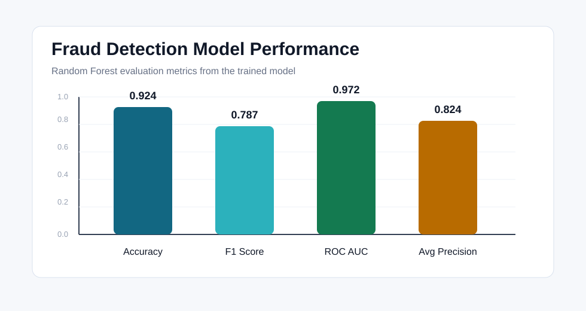

# Project Graphs

This page contains visible graph evidence for the project.

## Model Performance Graph

The trained fraud detection model produced these evaluation metrics:

- Accuracy: `0.924`
- F1 Score: `0.7865`
- ROC AUC: `0.9717`
- Average Precision: `0.8242`



## Monitoring Graphs

Grafana dashboard configuration is available at:

```text
infra/monitoring/grafana/dashboards/fraud-detection-dashboard.json
```

It contains graph panels for request rate, error rate, latency, fraud predictions, CPU usage, and memory usage.
